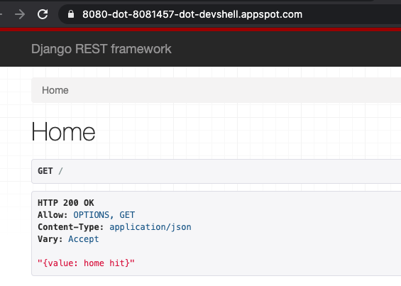

# Pods running with node port on GKE

### targetPort
is the port the container accepts traffic on,

### port
is the abstracted Service port, which can be any port other pods use to access the Service

## Deployment steps are same as of cluster IP.

Create a service with deployment.
```
kubectl apply -f pods_deployment.yml
kubectl apply -f pods_svc.yml
```

Get service and endpoint details 
```
kubectl describe services 
kubectl get ep django-k8s-svc
```


With Nodeport, we access the pod with NODEIP:NODE_PORT. `curl http://node_ip:node_port` should return success. Check if you have to add firewall rule to allow nodeport.
You can get name of node by `kubectl get pods -o wide` and use it to get the ip address.
``
Cluster IP is set automatically.

we are running this from machine which has different IP other than cluster. If we run this command from inside of cluster it will be successful.
We but cannot do that.
But we can do port forwarding.

 - On chosen node, create a firewall rule that allows TCP traffic on your node port
 - at least in GKE, `kubectl port-forward $(kubectl get pod --selector="app=web" --output jsonpath='{.items[0].metadata.name}') 8080:8000`
   - then click on web preview on port 8080

e.g,
```
$(kubectl get pod --selector="app=web" --output jsonpath='{.items[0].metadata.name}') 8080:8000
Forwarding from 127.0.0.1:8080 -> 8000
Handling connection for 8080
Handling connection for 8080
Handling connection for 8080
Handling connection for 8080
```


